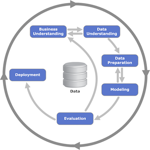

# Heart Disease Classification on the Google Cloud

## Purpose:
This repo contains a basic recipe to deploy a simple scikit-learn pipeline using
the Google Cloud Platform's [AI Platform](https://cloud.google.com/ai-platform)

## Prerequisites:
This repo uses the basic tools of the trade including version control, python
virtual environments, and the Google Cloud software development kit. Here are
some links to get started:  

* [Google Cloud SDK](https://cloud.google.com/sdk)
* [Git](https://git-scm.com)
* Python 3.7
* [Anaconda](https://www.anaconda.com) **OR**
* [pip/venv](https://packaging.python.org/guides/installing-using-pip-and-virtual-environments/)

## Step 0: Download the Git Repository
Clone the repository locally using the command line:  

>`git clone https://github.com/smit5490/heart-disease-classification.git`

## Step 1: Configure your Data Science Environment
Next, cd into the repository and create a virtual environment called `venv`.
Make sure that your environment is using Python 3.7. Once your virtual
environment is created, use `pip` to install the package
requirements:  

>`pip install -r requirements.txt`

The requirements text installs the essential tools that we'll be using, namely:
* Pandas
* Numpy
* Matplotlib
* Scikit-Learn
* Seaborn
* Jupyter

**Note:** The requirements file installs the package versions that the Google
Cloud requires to properly run the scikit-learn pipeline.

## Step 2: Explore/Run the Provided Notebooks
A series of notebooks have been provided that follow the CRoss-Industry Standard
Process for Data Mining (CRISP-DM).

This is a standard framework used by data
scientists across many industries.
