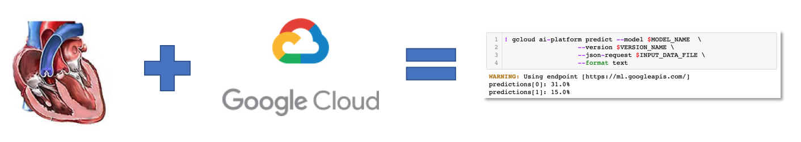
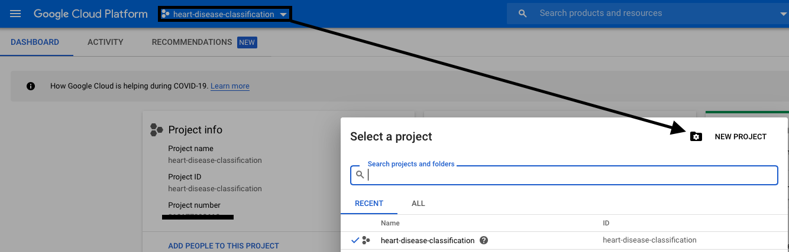

# Heart Disease Classification on the Google Cloud

## Purpose
This repository contains an end-to-end data science project that starts with exploring raw data and ends with deploying a custom prediction routine using the Google Cloud Platform's [AI Platform](https://cloud.google.com/ai-platform).

## Prerequisites
This repository assumes the user has basic familiarity with Python, virtual environments, and machine learning. Basic tools of the trade including Git/Github, Python, and virtual environments are used. Here are some links to get started:  

* [Git](https://git-scm.com)
* Python 3.7
* [Anaconda](https://www.anaconda.com) **OR**
* [pip/venv](https://packaging.python.org/guides/installing-using-pip-and-virtual-environments/)

## Step 0: Download the Git Repository
Clone the repository locally using the command line:  

`git clone https://github.com/smit5490/heart-disease-classification.git`

## Step 1: Configure your Data Science Environment
Next, cd into the repository and create a virtual environment called `venv`. Make sure that your environment is using Python 3.7. Once your virtual environment is created, use `pip` to install the package requirements:  

`pip install -r requirements.txt`

The requirements text installs the essential tools that we'll be using, namely:
* Pandas
* Numpy
* Matplotlib
* Scikit-Learn
* Seaborn
* Jupyter
* Plotly
* XGBoost

**Note:** The requirements file installs the package versions that the Google Cloud requires to properly run the custom prediction routine. The Google Cloud deploys the uploaded models in custom machine learning containers. It's important to review what containers are available ahead of time to ensure that the local environment used to build the model is compatible with the available deployment containers.

## Step 2: Set-up Google Cloud Environment & Install Google Cloud SDK
Now we are ready to do some initial set-up in the cloud. In order to interact with the Google Cloud Platform (GCP), a cloud account is needed.
1. Sign up for a Google Cloud account [here](https://cloud.google.com).  

2. Create a project. Projects provide a logical grouping of GCP services used to together for a particular use-case. The model and associated pipeline will be deployed inside this project. This can be done through the GCP console:
  

3. A billing account with a credit card also needs to be set-up in the GCP console. **The credit card will be charged for any Google Cloud services used in this repository.** Luckily, if you're using the GCP for the first time, Google provides a very generous Free Tier with a [12-month free trial and $300 in credits](https://cloud.google.com/free/docs/gcp-free-tier). You'll also want to make sure to [enable billing](https://cloud.google.com/billing/docs/how-to/modify-project) for this project.

4. Enable [AI Platform and Compute Engine APIs](https://console.cloud.google.com/flows/enableapi?apiid=ml.googleapis.com,compute_component). This step allows the project to access these GCP services.

5. Set-up the [Google Cloud SDK](https://cloud.google.com/sdk/docs/) and initialize the created project. Follow the quickstart guides for your operating system.

6. Set-up a [Service Account](https://console.cloud.google.com/apis/credentials/serviceaccountkey) which is a special account used by an application that is authorized to make API calls.
  * From the **Service account** drop-down list, select **New service account**.
  * In the Service account name field, enter a name.
  * From the Role drop-down list, select **Machine Learning Engine > AI Platform Admin and Storage > Storage Object Admin**.
  * Click *Create*. A JSON file that contains your key downloads to your computer. You'll need this file/file path for the last notebook when the model is deployed to the AI Platform.

## Step 3: Explore/Run the Provided Notebooks
A series of notebooks have been provided that follow the CRoss-Industry Standard Process for Data Mining (CRISP-DM).  

  

This is a standard framework used by data scientists across many industries to guide the development and deployment of machine learning models. In the deployment phase, we'll create a custom prediction routine that can be deployed to the Google Cloud. There are five Jupyter notebooks in the code folder that serve perform the following functions:  

* **01_business-and-data-understanding.ipynb:** This notebook covers the first two steps in CRISP-DM. The notebook provides a data dictionary of the fields used for prediction as well as exploratory analysis of those features to understand their distribution, missing values, frequency counts, etc.  
* **02_data-preparation.ipynb:** Building off of the previous notebook, a data pre-processing function is created and used to clean-up the data for downstream analysis. A pre-processed data set is returned.
* **03_model_experimentation.ipynb:** Several models and scikit-learn pipelines are trained and compared using RandomizedSearchCV. The experimentation in this file will guide the final model pipeline to be deployed.
* **04_final_classification_pipeline_and_model_evaluation.ipynb:** The final model will be further refined through a full GridSearchCV of the hyperparameters. An extensive exploration of the model's performance is also performed.
* **05_model_deployment.ipynb:** This final notebook is where our modeling meets the cloud. The scikit-learn modeling pipeline is updated and incorporated into a custom prediction routine that is suitable for deployment on the Google Cloud. Several python modules are created and combined into a source distribution package. The final model and data pre-processing function are pickled as well. Lastly, the script pushes all of the code to the necessary places in the cloud.

The other files in the *code* folder, including the *dist* folder are outputs from running the model deployment notebook. These resources are the ones that are pushed to the cloud to enable predictions. There is no reason to run any other code besides the provided notebooks.

## Other Google Cloud Resources:
Here are a few resources I used when learning how to deploy models on the GCP:
* [Introduction to GCP's AI Platform](https://cloud.google.com/ai-platform/docs/technical-overview)
* [Predictions with scikit-learn and XGBoost on the AI Platform](https://cloud.google.com/ai-platform/prediction/docs/getting-started-scikit-xgboost#upload-model)
* [GCP's Custom Prediction Routine Documentation](https://cloud.google.com/ai-platform/prediction/docs/custom-prediction-routines)
* [Google Colab Example of Custom Prediction Routine Deployment](https://colab.research.google.com/github/GoogleCloudPlatform/cloudml-samples/blob/master/notebooks/scikit-learn/custom-prediction-routine-scikit-learn.ipynb#scrollTo=2lTNSrN_Pp-H)
